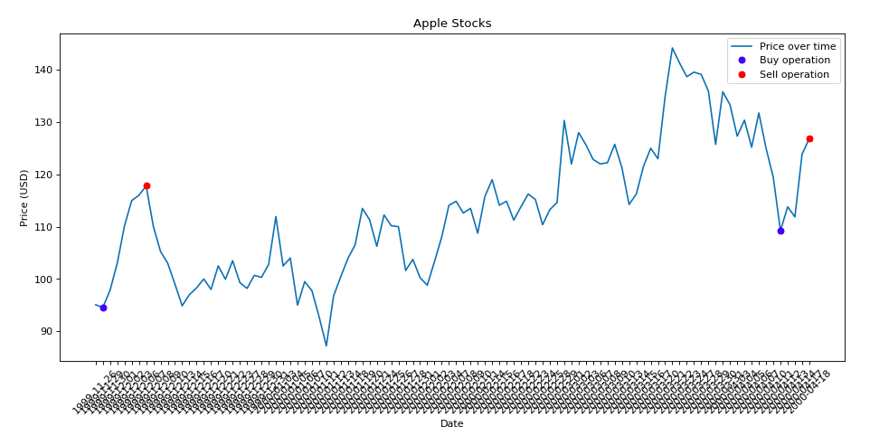

# Project 5 Capitalist Adventure

<h1 align="center">
   
    
   
</h1>

<h4 align="center"> Project 5 - Capitalist Adventure </h4>

  <a href="#about-the-project">About the project</a> •
  <a href="#how-to-use">How To Use</a> •

## Graphics generated on Companies Stocks only allowing 3 operations

  

  

  

  

**List Number**: 5 
**Course Content**: Programação dinâmica 

## Students
| Matrícula  | Aluno                              |
| ---------- | ---------------------------------- |
| 15/0150792 | Victor Moura                       |
| 16/0005191 | Durval Carvalho                    |

## About the project

This project was developed for the discipline
**Algorithm Project** of FGA College in the semester 02/2019.

This project aims to analyze the stock prices of a
particular company over a given period of time and calculate
the maximum profit possible with the limited amount of buy
and sell.

The main goal was to develop an application that uses
**dynamic programming** algorithm design paradigm.

We use data provided by the [Alpha Vantage](https://www.alphavantage.co/)
to get the historical values of the stock of a particular
company.

The application when launched returns a list of companies
available for analysis.

When the company and the analysis period are determined,
the purchase and sale dates are computed which will result
in the maximum gain and is generated graphic for better
visualization.

## How To Use
  
  Capitalist Adventure is available in [Google Colab](https://colab.research.google.com/github/projeto-de-algoritmos-2019-2/project-5-capitalist-adventure/blob/master/OptimalTradingStrategies_DPApproach.ipynb):

  

created by [Durval Carvalho](https://github.com/durvalcarvalho) and [Victor Moura](https://github.com/victorcmoura)
